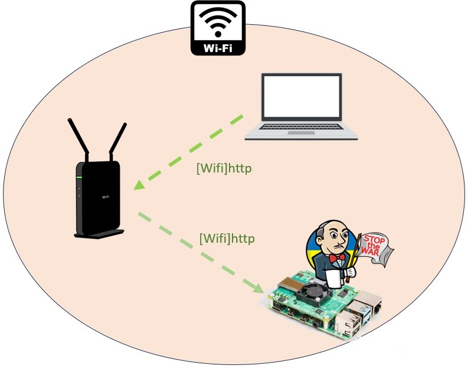

# jenkins
jenkinsをデプロイする環境

## jenkins-linux
linux用のjenkinsをデプロイする。

- 1.up.shでjenkinsを起動する。
- 3.backup.shはバックアップの例です。バックアップ先は適宜変更する必要があります。

## jenkins-win
windows用のjenkinsをデプロイする。公式サイトからwarをダウンロードすることが必要です。

